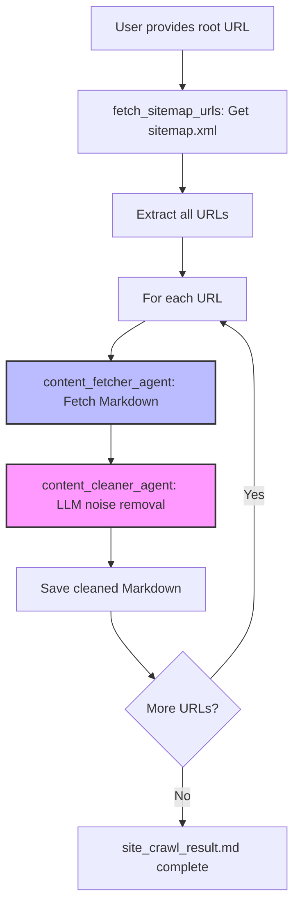

# Agentic Web Scraper

A high-precision, agent-driven web crawler that uses LLM, MCP, and Fetch MCP to extract main content and remove noise from web pages.

## Features
- **Agentic workflow**: Modular agents for sitemap parsing, content fetching, cleaning, and evaluation
- **LLM-powered cleaning**: Uses LLM to remove navigation, footers, ads, and other noise from Markdown content
- **Fetch MCP integration**: Robust content retrieval via MCP server
- **Flexible evaluation**: LLM-based or rule-based URL prioritization
- **Markdown output**: Clean, readable content saved as a single Markdown file

## Usage
1. Clone the repository:
   ```bash
   git clone https://github.com/KunihiroS/Agentic-web-scraper.git
   cd Agentic-web-scraper
   ```
2. Install dependencies (see requirements.txt)
3. Configure your MCP server and API keys as needed
4. Run the crawler:
   ```bash
   uv run agent.py
   ```
5. The cleaned content will be saved to `site_crawl_result.md`

## Architecture


## Technology
- This project is built using [fast-agent](https://fast-agent.ai/) for agent orchestration and MCP integration.

## License
MIT