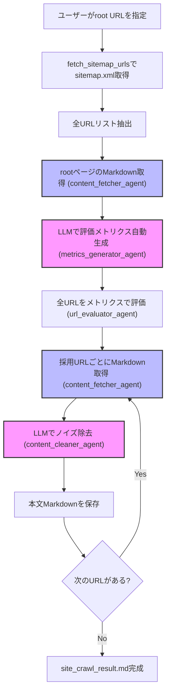

# Agentic Web Scraper

高精度なエージェント駆動型Webクローラー。LLM・MCP・Fetch MCPを活用し、Webページから本文のみを抽出しノイズを除去します。

## 特徴
- **LLMによる評価メトリクスの自動生成**: サイトのトップページからLLMが「重要なページの特徴語・カテゴリ・評価基準」を自動抽出
- **メトリクスに基づくページ評価・採用/非採用判断**: 生成されたメトリクスを使い、サイトマップの全URLをLLMまたはルールで評価し、クロール対象を自動決定
- **LLMによるノイズ除去**: ページ本文のMarkdownからナビゲーション・フッター・広告などのノイズをLLMで除去
- **Fetch MCP連携**: MCPサーバー経由で堅牢にページ内容を取得
- **Markdown出力**: クリーンな本文をMarkdownファイルに保存

## 利用方法
1. リポジトリをクローン:
   ```bash
   git clone https://github.com/KunihiroS/Agentic-web-scraper.git
   cd Agentic-web-scraper
   ```
2. [uv](https://docs.astral.sh/uv/)をインストールし、`fast-agent-mcp`をセットアップ:
   ```bash
   uv pip install fast-agent-mcp
   uv fast-agent setup
   ```
3. MCPサーバーやAPIキーを必要に応じて設定
4. クローラーを実行:
   ```bash
   uv run agent.py
   ```
5. 取得した本文は `site_crawl_result.md` に保存されます

## アーキテクチャ


## 技術スタック
- [fast-agent](https://fast-agent.ai/) をエージェントオーケストレーション・MCP連携に利用

## ライセンス
MIT
