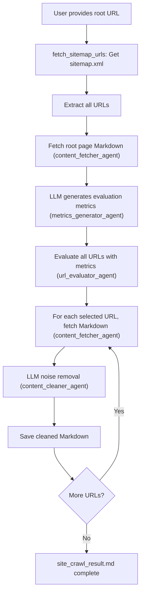

# Agentic Web Scraper

A high-precision, agent-driven web crawler that uses LLM, MCP, and Fetch MCP to extract main content and remove noise from web pages.

## Features
- **Automatic metrics generation by LLM**: The LLM analyzes the root page and generates a list of important page types, categories, or features to prioritize for crawling.
- **Page evaluation and selection based on metrics**: All URLs from the sitemap (or extracted links) are evaluated (by LLM or rule) using the generated metrics, and only relevant pages are crawled.
- **LLM-powered cleaning**: Removes navigation, footers, ads, and other noise from Markdown content using LLM (no summarization, just noise removal).
- **Fetch MCP integration**: Robust content retrieval via MCP server.
- **Playwright-based JS rendering**: If sitemap.xml is missing, Playwright is used to render the root page and extract links from the fully rendered DOM.
- **Markdown output**: Clean, readable content saved as a single Markdown file.

## URL Evaluation Logic

- **Scoring**:  
  - Currently, URLs are classified into two categories: `HIGH` and `LOW`.
  - If a URL contains any of the LLM-generated metric keywords that led by analysis of the root page, it is scored as `HIGH`. Otherwise, it is scored as `LOW`.
  - There is **no upper limit** on the number of URLs in each category; all matching URLs are scored as `HIGH`.
  - The system does not currently use a `MEDIUM` score, but this can be extended in the future.
- **Selection**:  
  - Only URLs scored as `HIGH` are crawled and processed for content extraction and cleaning.

## Prerequisites
- [uv](https://docs.astral.sh/uv/) and `uvx` must be available in your environment.
  - `uv` is a modern Python package manager and runner.
  - `uvx` allows running CLI tools (like `mcp-server-fetch` and Playwright) without manual installation; uvx will fetch and run them automatically as needed.
- No need to manually install `mcp-server-fetch` or Playwright browser binaries if using uv/uvx.
- **Dependencies**:  
  - See `requirements.txt` (install with `uv pip install -r requirements.txt`)
  - After installing, run:  
    ```bash
    uvx playwright install chromium
    ```

## Usage
1. Clone the repository:
   ```bash
   git clone https://github.com/KunihiroS/Agentic-web-scraper.git
   cd Agentic-web-scraper
   ```
2. Install dependencies:
   ```bash
   uv pip install -r requirements.txt
   uvx playwright install chromium
   ```
3. Configure your MCP server and API keys as needed (see `fastagent.config.yaml`)
4. Run the crawler (specify the root URL as an argument or interactively):
   ```bash
   uv run agent.py https://fast-agent.ai/
   ```
5. The cleaned content will be saved to `site_crawl_result.md`

## Architecture


## Technology Stack
- [fast-agent](https://fast-agent.ai/) for agent orchestration and MCP integration
- [uv](https://docs.astral.sh/uv/) and `uvx` for dependency and CLI tool management
- [playwright](https://playwright.dev/python/) for JavaScript rendering and dynamic link extraction

## License
MIT
