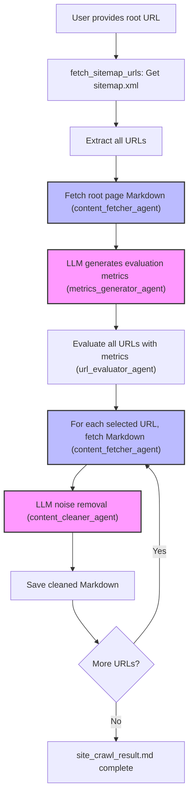

# Agentic Web Scraper

A high-precision, agent-driven web crawler that uses LLM, MCP, and Fetch MCP to extract main content and remove noise from web pages.

## Features
- **Automatic metrics generation by LLM**: The LLM analyzes the root page and generates a list of important page types, categories, or features to prioritize for crawling.
- **Page evaluation and selection based on metrics**: All URLs from the sitemap are evaluated (by LLM or rule) using the generated metrics, and only relevant pages are crawled.
- **LLM-powered cleaning**: Removes navigation, footers, ads, and other noise from Markdown content using LLM (no summarization, just noise removal).
- **Fetch MCP integration**: Robust content retrieval via MCP server.
- **Markdown output**: Clean, readable content saved as a single Markdown file.

## Prerequisites
- [uv](https://docs.astral.sh/uv/) and `uvx` must be available in your environment.
  - `uv` is a modern Python package manager and runner.
  - `uvx` allows running CLI tools (like `mcp-server-fetch`) without manual installation; uvx will fetch and run them automatically as needed.
- No need to manually install `mcp-server-fetch` or other MCP servers if using uv/uvx.

## Usage
1. Clone the repository:
   ```bash
   git clone https://github.com/KunihiroS/Agentic-web-scraper.git
   cd Agentic-web-scraper
   ```
2. Install fast-agent-mcp and set up:
   ```bash
   uv pip install fast-agent-mcp
   uv fast-agent setup
   ```
3. Configure your MCP server and API keys as needed (see `fastagent.config.yaml`)
4. Run the crawler (specify the root URL as an argument or interactively):
   ```bash
   uv run agent.py https://fast-agent.ai/
   ```
5. The cleaned content will be saved to `site_crawl_result.md`

## Architecture


## Technology Stack
- [fast-agent](https://fast-agent.ai/) for agent orchestration and MCP integration
- [uv](https://docs.astral.sh/uv/) and `uvx` for dependency and CLI tool management

## License
MIT
