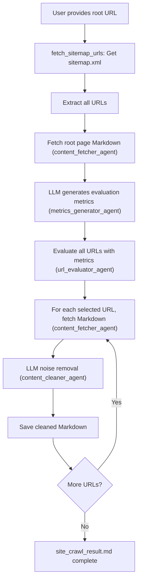

# Agentic Web Scraper

A high-precision, agent-driven web crawler that uses LLM, MCP, and Fetch MCP to extract main content and remove noise from web pages.

## Features
- **Automatic metrics generation by LLM**: The LLM analyzes the root page and generates a list of important page types, categories, or features to prioritize for crawling.
- **Page evaluation and selection based on metrics**: All URLs from the sitemap (or extracted links) are evaluated (by LLM or rule) using the generated metrics, and only relevant pages are crawled.
- **LLM-powered cleaning**: Removes navigation, footers, ads, and other noise from Markdown content using LLM (no summarization, just noise removal).
- **Fetch MCP integration**: Robust content retrieval via MCP server.
- **Playwright-based JS rendering**: If sitemap.xml is missing, Playwright is used to render the root page and extract links from the fully rendered DOM.
- **Markdown output**: Clean, readable content saved as a single Markdown file.

## URL Evaluation Logic

- **Scoring**:  
  - Currently, URLs are classified into two categories: `HIGH` and `LOW`.
  - If a URL contains any of the LLM-generated metric keywords that led by analysis of the root page, it is scored as `HIGH`. Otherwise, it is scored as `LOW`.
  - There is **no upper limit** on the number of URLs in each category; all matching URLs are scored as `HIGH`.
  - The system does not currently use a `MEDIUM` score, but this can be extended in the future.
- **Selection**:  
  - Only URLs scored as `HIGH` are crawled and processed for content extraction and cleaning.

## Prerequisites
- [uv](https://docs.astral.sh/uv/) and `uvx` must be available in your environment.
  - `uv` is a modern Python package manager and runner.
  - `uvx` allows running CLI tools (like `mcp-server-fetch` and Playwright) without manual installation; uvx will fetch and run them automatically as needed.
- No need to manually install `mcp-server-fetch` or Playwright browser binaries if using uv/uvx.
- **Dependencies**:  
  - See `requirements.txt` (install with `uv pip install -r requirements.txt`)
  - After installing, run:  
    ```bash
    uvx playwright install chromium
    ```

## Usage
1. Clone the repository:
   ```bash
   git clone https://github.com/KunihiroS/Agentic-web-scraper.git
   cd Agentic-web-scraper
   ```
2. Install dependencies:
   ```bash
   uv pip install -r requirements.txt
   uvx playwright install chromium
   ```
3. Configure your MCP server and API keys as needed (see `fastagent.config.yaml`)
4. Run the crawler (specify the root URL as an argument or interactively):
   ```bash
   uv run agent.py https://fast-agent.ai/
   ```
5. The cleaned content will be saved to `site_crawl_result.md`

## Architecture


## Technology Stack
- [fast-agent](https://fast-agent.ai/) for agent orchestration and MCP integration
- [uv](https://docs.astral.sh/uv/) and `uvx` for dependency and CLI tool management
- [playwright](https://playwright.dev/python/) for JavaScript rendering and dynamic link extraction

## License
MIT

---

## 改修計画（今後の改善方針・具体案）

1. **対象URLリストの保存と進捗管理**
   - クロール対象となる全URLを最初に抽出し、`crawl_targets_{hash}.json` などのJSONファイルに保存。
   - JSON構造例:
     ```json
     [
       {"url": "https://example.com/page1", "status": "pending", "error": null},
       {"url": "https://example.com/page2", "status": "success", "error": null},
       {"url": "https://example.com/page3", "status": "failed", "error": "TimeoutError"}
     ]
     ```
   - 各URLの状態（pending/success/failed）やエラー内容を随時更新し、上書き保存。

2. **作業量見積もり・ユーザー確認フロー**
   - URLリストの総件数、サンプル（最初の5件）、推定作業時間（例: 1件あたり平均5秒×件数）、推定トークン消費量（例: 1件あたり平均3000tokens×件数）をユーザーに表示。
   - 例:  
     ```
     対象URL数: 120件
     サンプル: https://example.com/page1, ...
     推定作業時間: 約10分
     推定トークン消費: 約36万tokens
     ```
   - ユーザーに「全件実行」「やめる」「一部のみ実行」などの選択肢をダイアログやCLIプロンプトで提示。

3. **agent（LLM）による優先度提案とユーザー判断ループ**
   - 「一部のみ実行」選択時、agent（LLM）がURLリストやページタイトル・パス・メタ情報等を分析し、優先度の高いURLや推奨範囲（例: ドキュメント系、APIリファレンス系など）を提案。
   - 例:  
     ```
     LLM提案: 「API」「Guide」「Reference」を含むページを優先的に処理することを推奨します。
     推奨URL: https://example.com/api, https://example.com/guide, ...
     ```
   - ユーザーは提案を受けて範囲を調整・再確認できる。納得いくまでこのループを繰り返し可能。

4. **最終確認と安全な意思決定**
   - 最終的に「この内容で実行しますか？（Y/N）」と明示的に確認。
   - Yで実行、Nで中断。最大処理件数やサンプル実行などの追加オプションも選択可能。

5. **逐次書き出し・エラー記録・レジューム**
   - 各URLの処理が終わるたびに `site_crawl_result.md` にappendで追記。
   - 失敗時はエラー内容もMarkdownに記録（例: `# URL\n\n[ERROR] TimeoutError`）。
   - 途中中断時も進捗JSONを参照し、「status: pending/failed」のURLのみ再開対象とする。
   - レジューム時の手順例:
     1. `crawl_targets_{hash}.json` を読み込む
     2. statusがpending/failedのURLのみ再処理
     3. 成功したらstatusをsuccessに、失敗したらfailed+errorに更新

6. **柔軟な実行範囲選択と安全な運用**
   - 必要に応じて「最大処理件数」「サンプルのみ実行」などのオプションをCLIやUIで指定可能。
   - APIコストや障害時のリカバリを容易にし、ユーザーの納得感ある運用を実現。

---
